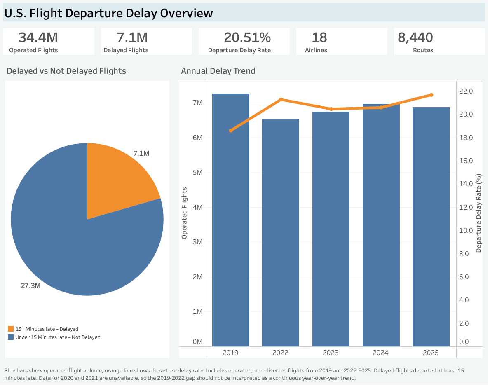
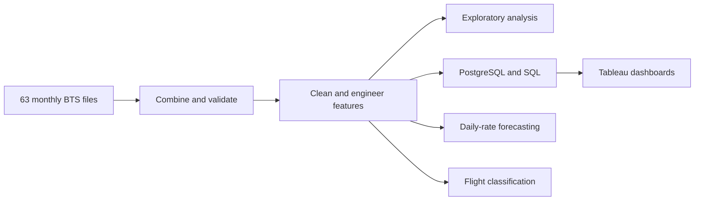
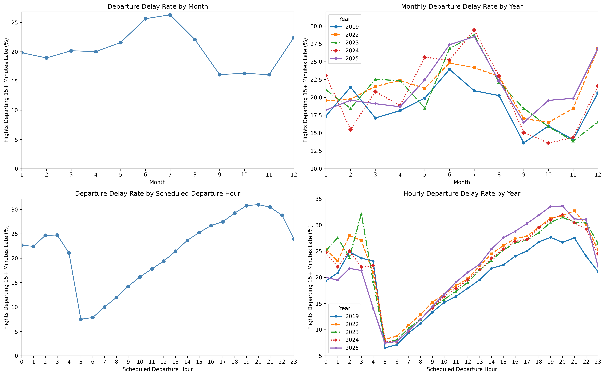
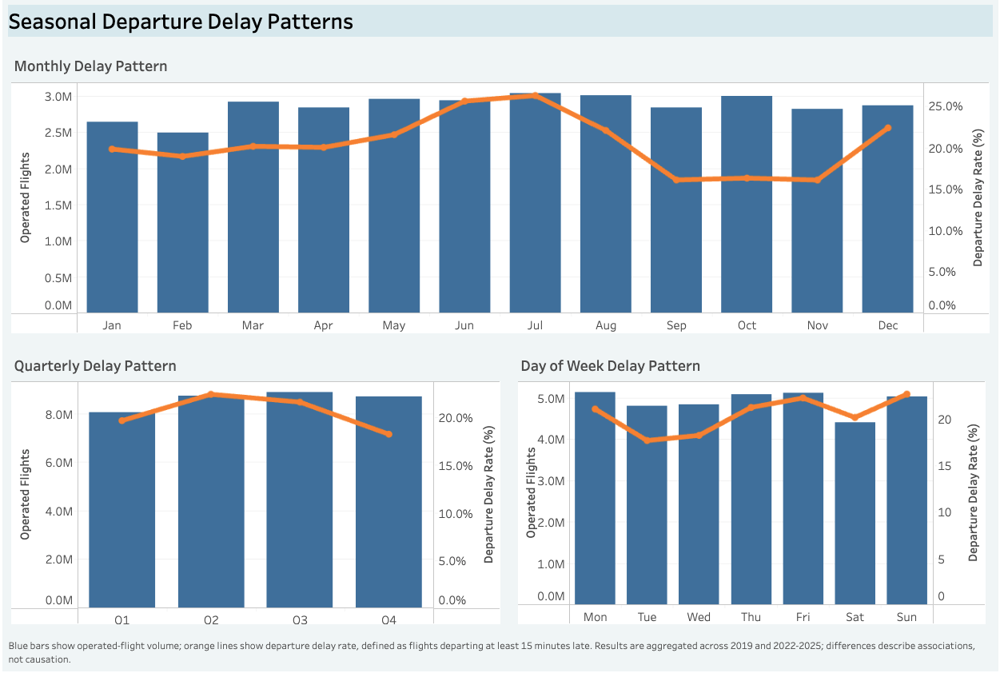
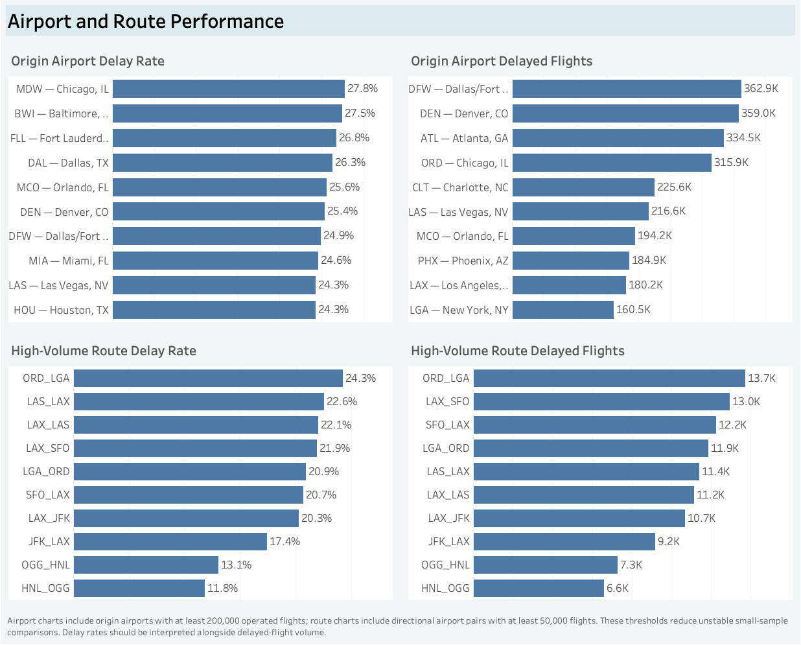
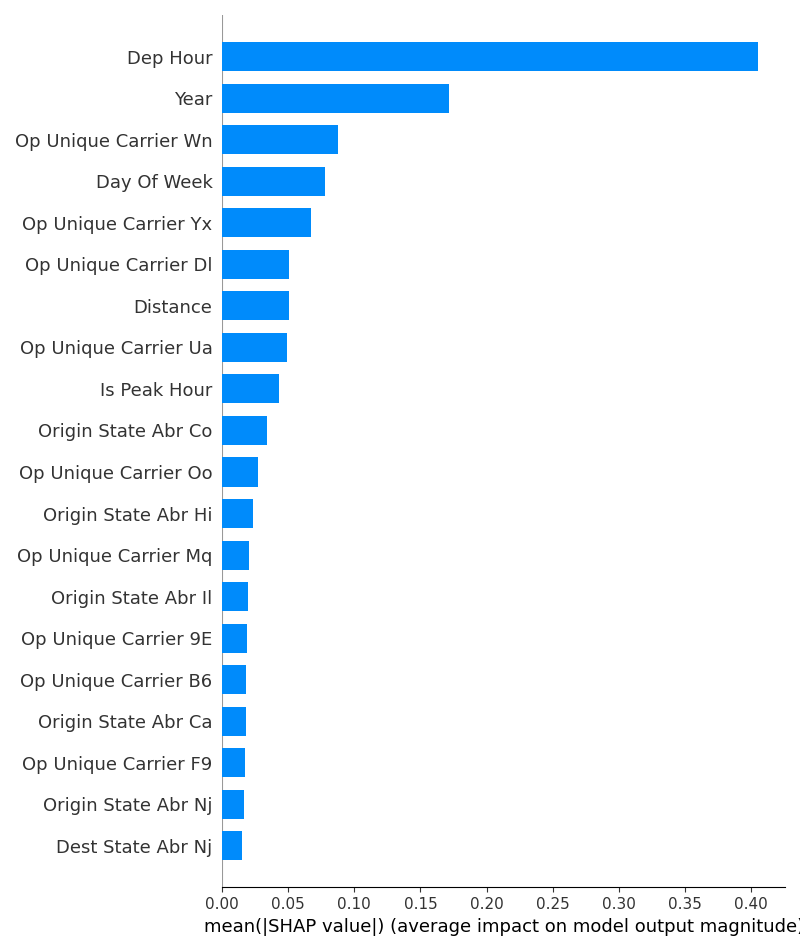

# U.S. Flight Departure Delay Analysis

## Project Overview

This project analyzes 36 million U.S. domestic flights to determine when and where departure delays occur, how severe they become, and how reliably they can be predicted. Flight delays affect schedule reliability, aircraft and crew utilization, airport operations, and the passenger experience, making both delay frequency and delay severity useful operational measures.

I built an end-to-end workflow in Python, PostgreSQL, SQL, and Tableau, then evaluated time-series and classification models. The final outputs include seven Tableau dashboards, reusable SQL reporting datasets, a daily delay-rate forecast, and a flight-level classification experiment.

> **Delay definition:** a flight is delayed when it departs at least 15 minutes after its scheduled departure time. Descriptive results include operated, non-diverted flights from the complete years 2019 and 2022–2025.

## Headline Results

- The complete-year departure-delay rate was **20.51%**, representing approximately 7.1 million delayed flights.
- Delay risk was lowest around **5–6 a.m.** and generally increased through the day to roughly **31% in the evening**.
- Prophet produced the best validation forecast, but its MAE rose from **3.24 percentage points** in Q3 2025 to **6.95 points** in the untouched Q1 2026 test.
- XGBoost achieved the highest classification validation ROC-AUC at **67.4%**, but Logistic Regression provided the most useful default-threshold balance, with **66.1% validation recall** and a **41.3% F1 score**.



The executive dashboard shows that approximately one in five operated flights departed at least 15 minutes late and places that rate beside annual flight volume.

[Explore the interactive Executive Overview on Tableau Public](https://public.tableau.com/app/profile/david.dupre7494/viz/U_S_FlightDepartureDelayOverview/Dashboard1U_S_FlightDepartureDelayAnalysis)

## Business Problem and Analytical Questions

Average delay alone can hide important differences in exposure, timing, and severity. A large airline can generate many delayed flights while maintaining a moderate delay rate, whereas a smaller route may show a high rate based on limited volume. The analysis therefore evaluates delay rates beside flight counts and uses thresholds for airport and route comparisons.

The project addresses seven questions:

1. How common are departure delays among operated flights?
2. How do delay rates vary by year, season, weekday, and scheduled departure hour?
3. Which airlines, airports, and high-volume routes experience the most delays?
4. How severe are arrival and departure delays among delayed flights?
5. Which reported operational causes account for the most delays?
6. Can historical calendar patterns forecast the daily delay rate?
7. Can schedule-time information identify flights likely to be delayed?

## Objectives

- Measure delay frequency and severity using consistent definitions.
- Identify seasonal, hourly, airline, airport, and route patterns.
- Build reusable SQL datasets and interactive Tableau dashboards.
- Compare forecasting methods using chronological validation.
- Evaluate flight-level classifiers without using post-departure information.
- Translate the results into practical operational implications and realistic next steps.

## Dataset

| Item | Details |
|---|---|
| Data source | U.S. Bureau of Transportation Statistics on-time performance data |
| Unit of analysis | One scheduled domestic flight record |
| Full data coverage | January 2019–March 2026, excluding 2020–2021 |
| Cleaned dataset | 36,000,275 flights |
| Descriptive dataset | 34,388,401 flights from complete years |
| Main outcome | Departure delay of 15 minutes or more |
| Important variables | Flight date, carrier, airports, route, scheduled departure time, delay minutes, distance, and reported delay causes |

The full cleaned dataset supports model development and the Q1 2026 test. Descriptive analysis uses only complete years: 2019 and 2022–2025. The missing pandemic years prevent a continuous comparison between 2019 and 2022.

## Tools and Technologies

| Area | Technologies |
|---|---|
| Data preparation and analysis | Python, pandas, NumPy |
| Database and reporting | PostgreSQL, SQL, SQLAlchemy, psycopg2 |
| Visualization | Tableau, Matplotlib |
| Forecasting | statsmodels, pmdarima, Prophet, holidays |
| Classification and interpretation | scikit-learn, XGBoost, SHAP |

## Analytical Approach



### 1. Data preparation

[`combine_monthly_files.py`](code/combine_monthly_files.py) validates and combines 63 monthly source files. [`clean_flights.py`](code/clean_flights.py) then:

- standardizes column names and data types;
- removes exact duplicates;
- excludes cancelled and diverted flights from the operated-flight dataset;
- checks extreme values without automatically deleting plausible disruptions;
- creates calendar, route, operating-period, and delay features; and
- writes the analytical dataset to `processed/flights_all_cleaned.csv`.

| Feature | Definition |
|---|---|
| `is_delayed` | 1 when `dep_delay >= 15`, otherwise 0 |
| `delay_category` | Groups flights into early/on-time, minor, moderate, severe, and extreme departure-delay categories |
| `day_of_year` | Calendar day from 1 through 366 |
| `week_of_year` | ISO calendar week |
| `dep_hour` | Scheduled departure hour |
| `is_peak_hour` | 1 from 5:00–9:59 a.m. or 4:00–7:59 p.m. |
| `is_weekend` | 1 on Saturday or Sunday |
| `route` | Directional origin–destination pair |
| `main_delay_cause` | Reported cause with the most positive delay minutes |

Scheduled departure time is used instead of actual departure time to prevent post-departure information from leaking into predictive models.

### 2. Exploratory analysis

[`eda_simple.py`](code/eda_simple.py) analyzes annual volume, delay prevalence, seasonality, operating patterns, distributions, and extreme values.



The annual delay rate was lowest in 2019 at 18.6% and highest in 2025 at 21.7%. Because 2020 and 2021 are absent, the movement from 2019 to 2022 is a gap in coverage—not a continuous year-over-year trend.

Extreme delays were retained because they are part of the operational phenomenon. Delays above 300 minutes represented only about 0.46% of observations.

### 3. PostgreSQL, SQL, and Tableau

[`load_to_postgres.py`](code/load_to_postgres.py) loads the cleaned CSV into PostgreSQL. The analytical layer in [`aviation_delay_tableau_queries.sql`](sql/aviation_delay_tableau_queries.sql) produces reusable metrics for airlines, airports, routes, time periods, delay causes, and dashboard KPI cards.

[`export_tableau_results.py`](code/export_tableau_results.py) refreshes 21 compact reporting tables in [`sql_exports`](sql_exports), avoiding the need to load tens of millions of rows into every Tableau worksheet.

The Tableau analysis contains seven dashboards:

1. [Executive Overview](https://public.tableau.com/app/profile/david.dupre7494/viz/U_S_FlightDepartureDelayOverview/Dashboard1U_S_FlightDepartureDelayAnalysis)
2. [Seasonal Departure Delay Patterns](https://public.tableau.com/app/profile/david.dupre7494/viz/SeasonalDepartureDelayPatterns/Dashboard2SeasonalDepartureDelayPatterns)
3. [Hourly and Operating Departure Delay Patterns](https://public.tableau.com/app/profile/david.dupre7494/viz/HourlyandOperatingDepartureDelayPatterns/Dashboard3HourlyandOperatingDepartureDelayPatterns)
4. [Airline Performance](https://public.tableau.com/app/profile/david.dupre7494/viz/AirlineDelayPerformance_17869876261480/Dashboard4AirlinePerformance)
5. [Airline Delay Severity](https://public.tableau.com/app/profile/david.dupre7494/viz/AirlineDelaySeverity/Dashboard5AirlineDelaySeverity)
6. [Airports and Routes](https://public.tableau.com/app/profile/david.dupre7494/viz/AirportandRoutePerformance/Dashboard6AirportsandRoutes)
7. [Delay Causes and Severity](https://public.tableau.com/app/profile/david.dupre7494/viz/DelayCausesandDistancePatterns/Dashboard7DelayCausesandSeverity)

The latest workbook is [`Recovered_Aviation_Dashboards_2026-08-07.twb`](plots/Recovered_Aviation_Dashboards_2026-08-07.twb). See the [`Tableau dashboard build guide`](TABLEAU_DASHBOARD_BUILD_GUIDE.md) for worksheet definitions and assembly notes.

#### Dashboard showcase



The seasonal dashboard compares monthly, quarterly, and weekday patterns while keeping operated-flight volume visible beside delay rate.



The airport and route dashboard separates delay likelihood from delayed-flight volume and applies minimum-volume thresholds to reduce unstable comparisons.

Additional dashboard screenshots:

- [Hourly and operating patterns](plots/tableau_dashboards/03_hourly_operating_patterns.png)
- [Airline performance](plots/tableau_dashboards/04_airline_performance.png)
- [Airline delay severity](plots/tableau_dashboards/05_airline_severity.png)
- [Delay causes and distance patterns](plots/tableau_dashboards/07_delay_causes_distance.png)

### 4. Daily delay-rate forecasting

[`forecasting_calendar_no_defs.py`](code/forecasting_calendar_no_defs.py) uses Q3 2025 for model comparison and Q1 2026 as a single untouched final test.

Before modeling, I reviewed the training-series [ACF and PACF](plots/forecast_02_acf_pacf.png) to assess short-term and weekly dependence. After forecasting, I examined the forecast-error ACF and PACF to determine whether the selected model had removed that structure.

I also applied the Augmented Dickey–Fuller test to the 2022–2025 daily delay-rate series. The test returned an ADF statistic of **−5.0115** and a **p-value of 0.000021**. Because the p-value was below 0.05, I rejected the unit-root null hypothesis. This supports treating the series as stationary for model development, although the test does not prove that every component of the series is stationary.

| Model | Q3 2025 MAE | Q3 2025 RMSE | Q3 2025 MAPE |
|---|---:|---:|---:|
| Naive baseline | 6.93 pp | 8.24 pp | 41.00% |
| Recent weekday average | 5.57 pp | 6.91 pp | 25.33% |
| Manual SARIMA | 5.35 pp | 6.68 pp | 26.80% |
| Auto SARIMA | 4.82 pp | 6.10 pp | 25.23% |
| SARIMAX + holidays | 4.80 pp | 6.07 pp | 25.14% |
| **Prophet + holidays** | **3.24 pp** | **4.03 pp** | **14.93%** |

After selection, Prophet was retrained through December 2025 and evaluated on Q1 2026. Its final MAE was **6.95 percentage points**, showing weaker performance than in validation. The forecast-error ACF showed the strongest remaining autocorrelation at lags 1 and 2, indicating that errors on one day were related to errors over the following two days. Ljung–Box tests were also significant at lags 7, 14, 21, and 28 (`p < 0.001` at each horizon), showing that the errors were not independently distributed across one- to four-week windows. Each Ljung–Box result evaluates the lags collectively through that horizon rather than only the final numbered lag. Prophet captured broad calendar patterns but left short-term and multiweek dependence unexplained, so it is best treated as a calendar-pattern benchmark rather than a production disruption forecast.


The forecast-error ACF and PACF support the residual diagnostics above: short-run dependence remained after forecasting, so the model did not fully capture the daily time-series structure.

### 5. Delay classification

[`classification_simple.py`](code/classification_simple.py) compares five classifiers on a reproducible 10% sample of 3.6 million flights. Training uses data through 2024, validation uses 2025, and Q1 2026 is held out for final testing.

The features are limited to schedule-time information: calendar fields, scheduled hour, distance, carrier, origin and destination state, and route.

| Model | Validation ROC-AUC | Validation recall | Validation F1 |
|---|---:|---:|---:|
| Logistic Regression | 65.6% | 66.1% | 41.3% |
| AdaBoost | 65.8% | 0.0% | 0.0% |
| Random Forest | 64.4% | 63.4% | 40.5% |
| Extra Trees | 62.0% | 60.1% | 38.3% |
| **XGBoost** | **67.4%** | **1.5%** | **2.9%** |

Model rankings depended on the evaluation metric. XGBoost ranked first by ROC-AUC, which measures how well predicted probabilities rank delayed flights above non-delayed flights across all possible thresholds. At its default threshold, however, it classified almost every flight as non-delayed: Q1 2026 recall was only **0.2%** despite 78.0% accuracy.

Logistic Regression was the more useful default-threshold benchmark. It achieved the highest validation recall (**66.1%**) and F1 score (**41.3%**) among the five models, although its ROC-AUC was lower at 65.6% and its precision was only 30.0%. This trade-off makes the model more relevant when the objective is to identify a meaningful share of delayed flights rather than maximize overall accuracy. Neither model is ready for operational deployment without threshold tuning, cost-sensitive evaluation, and richer pre-departure features.



Scheduled departure hour was the most influential feature in the logistic-regression SHAP analysis. These values describe predictive associations within the model; they do not establish that a feature causes delays.

## Key Findings and Business Interpretation

### Delay exposure depends on both rate and volume

The complete-year dataset contained **34.4 million operated flights** and a **20.51% delay rate**. Rate and volume answer different questions: delay rate measures the likelihood of disruption, while delayed-flight count reflects the total operational exposure. Airline, airport, and route comparisons should therefore consider both measures before prioritizing attention.

### Early departures provide the most reliable operating window

Delay rates were approximately **7%–8% around 5–6 a.m.** and generally increased throughout the day, reaching about **31% in the evening**. This pattern is consistent with disruptions accumulating across aircraft rotations and airport networks, although the observational data cannot prove that mechanism. For schedule-sensitive passengers or operations, departure time is an important risk indicator.

### Seasonal planning matters

June and July recorded delay rates of approximately **25.6%–26.3%**, while September through November were near **16%**. Airlines and airports could use these recurring differences as a baseline for seasonal staffing, schedule resilience, and passenger communication. Weather and capacity data would be needed before attributing the pattern to specific causes.

### Averages understate the shape of disruption risk

Median departure delay was **−2 minutes**, compared with a mean of **12.4 minutes**. Most flights operated close to schedule, but a small number of extreme disruptions created a long right tail. Reporting only the mean would obscure both the typical flight experience and the low-frequency risk of severe delays.

### Model selection metrics must match the decision

The forecasting and classification experiments both show the risk of relying on one headline metric. Prophet led the validation forecast comparison but weakened in the next quarter. XGBoost led by ROC-AUC but detected almost none of the delayed flights at its default threshold, while Logistic Regression accepted lower accuracy and precision to identify far more delayed flights. The preferred model therefore depends on the operational cost of missed delays versus false alerts.

## Recommendations

- Evaluate delay rate beside operated-flight and delayed-flight volume when prioritizing airlines, airports, or routes.
- Use early-day versus late-day risk patterns as a planning baseline, while recognizing that passengers cannot always shift departure times.
- Prepare additional operational capacity and communication plans for historically high-delay summer periods, subject to confirmation with weather and capacity data.
- Treat the forecasting model as a calendar benchmark rather than a live disruption forecast.
- Use Logistic Regression as the interpretable classification benchmark, but do not deploy either classifier at its current threshold; first evaluate precision–recall trade-offs and the cost of false negatives.

## Skills Demonstrated

- Large-scale data cleaning, validation, and feature engineering
- Exploratory analysis and KPI development
- PostgreSQL querying, aggregation, CTEs, and reusable reporting datasets
- Tableau dashboard design and business intelligence reporting
- Time-series forecasting with chronological validation
- Classification model comparison and class-imbalance evaluation
- SHAP-based model interpretation
- Business interpretation and communication of analytical limitations

## Development Note

Generative AI provided substantial assistance with implementing the forecasting and classification workflows and with structuring and editing project documentation, including this README. I defined the analytical questions and data scope, executed and reviewed the workflows, validated the saved results, selected the material presented, and interpreted the findings and limitations. The modeling components represent applied model evaluation and guided learning rather than independent machine-learning engineering. I reviewed the final documentation and take responsibility for its accuracy.

## Repository structure

```text
aviation_delay_analysis/
├── code/              # Preparation, EDA, database, forecasting, and ML scripts
├── raw_data/          # Monthly BTS files and combined raw data
├── processed/         # Cleaned analytical dataset
├── sql/               # PostgreSQL reporting queries
├── sql_exports/       # Tableau-ready query outputs
├── query_results/     # Model metrics and analytical results
├── plots/             # Charts, diagnostics, and Tableau workbooks
├── archive/           # Earlier experiments and superseded files
├── PROJECT_GUIDE.md
├── requirements.txt   # Python dependencies
└── README.md
```

## Reproducing the project

### Requirements

- Python 3
- PostgreSQL (optional for SQL and Tableau refresh)
- Tableau Desktop or Tableau Public (optional)

```bash
python -m pip install -r requirements.txt
```

The scripts resolve the repository root automatically. The raw BTS files are too large for a normal Git repository and must be downloaded separately before rebuilding the complete dataset.

### Run order

```bash
python code/combine_monthly_files.py
python code/clean_flights.py
python code/eda_simple.py
python code/EDA_forecasting.py
python code/forecasting_calendar_no_defs.py
python code/classification_simple.py
```

For the optional PostgreSQL and Tableau workflow:

```bash
export DB_PASSWORD="your_postgresql_password"
export DB_USER="postgres"
export DB_HOST="localhost"
export DB_PORT="5432"
export DB_NAME="flight_delays"

python code/load_to_postgres.py
python code/export_tableau_results.py
```

## Limitations

- 2020 and 2021 are not included, so the available years do not form an uninterrupted time series.
- Only Q1 is available for 2026; it is used for final model testing, not full-year comparisons.
- Cancelled and diverted flights are excluded, so the project does not measure total passenger disruption risk.
- Reported delay causes represent operational classifications rather than causal estimates. A flight may involve multiple contributing factors, so the assigned main cause should not be interpreted as the sole reason for the delay.
- Airline, airport, route, and calendar comparisons do not control for schedule mix, weather, geography, or network structure.
- The models rely mainly on calendar and schedule information; they cannot anticipate sudden weather or network disruptions.

## Future Improvements

- Add weather, airport congestion, aircraft rotation, and network-status features.
- Use rolling-origin evaluation across several forecast and classification periods.
- Tune classification thresholds using precision–recall curves and explicit misclassification costs.
- Test class weighting, probability calibration, and additional time-aware features.
- Add dashboard filters that connect delay rate, flight volume, and severity in the same decision view.

## Selected outputs

- [Forecast metrics](query_results/calendar_forecast_metrics_no_defs.csv)
- [Forecast summary](query_results/calendar_forecast_summary_no_defs.txt)
- [Classification model comparison](query_results/classification_model_comparison.csv)
- [Classification summary](query_results/simple_classification_metrics.txt)
- [Tableau workbook](plots/Recovered_Aviation_Dashboards_2026-08-07.twb)
- [Project run guide](PROJECT_GUIDE.md)

## Conclusion

U.S. departure delays show clear seasonal and time-of-day patterns, but severe disruption days remain difficult to predict from calendar and schedule data alone. The project turns a large public dataset into operational KPIs, Tableau reporting, and evaluated predictive models. It demonstrates the full analytical process—from data preparation and SQL analysis to model validation, business interpretation, and clear communication of uncertainty.
